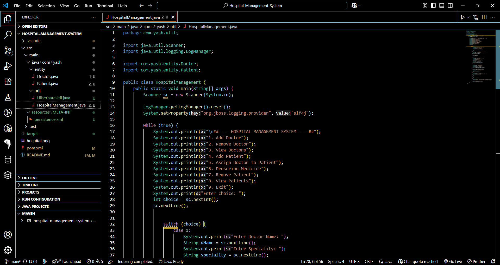
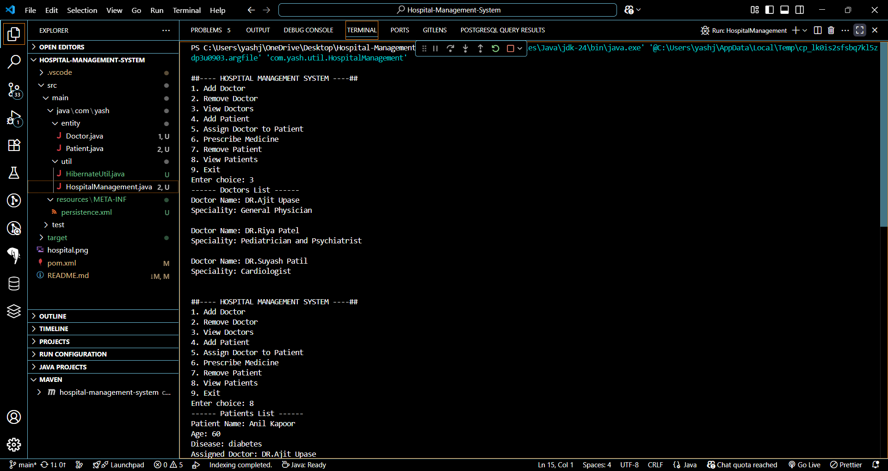
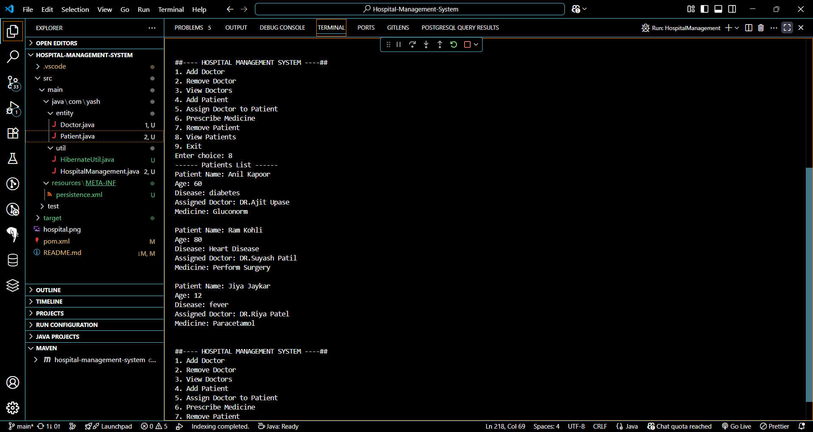

#  HOSPITAL MANAGEMENT SYSTEM
[](https://www.oracle.com/java/) 
[](https://www.postgresql.org/) 
[](https://maven.apache.org/) 
[](LICENSE)

---

The **HOSPITAL MANAGEMENT SYSTEM** is a **console-based application** built using **CORE JAVA**, **JDBC**, and **POSTGRESQL**. It allows users to perform various operations to manage doctor and patient records stored in a PostgreSQL database. The application provides an **intuitive MENU-DRIVEN INTERFACE** for seamless hospital administration.  

---

#  FEATURES

-  **ADD DOCTOR**: Add a new doctor record with name and specialty.  
-  **VIEW ALL DOCTORS**: Fetch and display all doctor records.  
-  **REMOVE DOCTOR**: Delete a doctor record by name.  
-  **ADD PATIENT**: Add a new patient record with details such as name, age, ID, and diagnosed disease.  
-  **ASSIGN DOCTOR**: Assign a doctor to treat a patient.  
-  **PRESCRIBE MEDICINE**: Automatically prescribe medicine based on the patient’s disease.  
-  **VIEW ALL PATIENTS**: Fetch and display all patient records, including assigned doctor and prescribed medicine.  
-  **REMOVE PATIENT**: Delete a patient record by patient ID.  
-  **MENU-DRIVEN INTERFACE**: Easy-to-use console interface for managing doctors and patients.  
-  **BACKGROUND THREAD**: Simulates background tasks in the system.  

---

#  TECHNOLOGIES USED

- **CORE JAVA**: For implementing application logic and OOP concepts.  
- **JDBC (JAVA DATABASE CONNECTIVITY)**: For connecting to and interacting with the POSTGRESQL database.  
- **POSTGRESQL**: For storing and managing hospital data.  
- **Hibernate JPA**: 7.0.5.Final
- **Jakarta Persistence API**: 3.2.0
- **MAVEN**: For project dependency management and building the project.  

---

#  DEPENDENCIES

This project uses the following Maven dependency:  

```xml
<!-- Hibernate ORM -->
<dependency>
    <groupId>org.hibernate.orm</groupId>
    <artifactId>hibernate-core</artifactId>
    <version>7.0.5.Final</version>
</dependency>

<!-- Jakarta Persistence API -->
<dependency>
    <groupId>jakarta.persistence</groupId>
    <artifactId>jakarta.persistence-api</artifactId>
    <version>3.2.0</version>
</dependency>

<!-- PostgreSQL JDBC Driver -->
<dependency>
    <groupId>org.postgresql</groupId>
    <artifactId>postgresql</artifactId>
    <version>42.7.7</version>
</dependency>

```
---


#  PREREQUISITES
Make sure you have:

 **JAVA DEVELOPMENT KIT (JDK) 17 or higher**.

 **APACHE MAVEN 3.8.6 or higher**.

 **POSTGRESQL 15 or higher**.

---

# 🗄 DATABASE SETUP
**Create a PostgreSQL database named hospitaldb with the following tables:**

```sql

CREATE DATABASE hospitaldb;

CREATE TABLE doctor (
    dName VARCHAR(100) PRIMARY KEY,
    speciality VARCHAR(100) NOT NULL
);

CREATE TABLE patient (
    pName VARCHAR(100) NOT NULL,
    age INT NOT NULL,
    p_id INT PRIMARY KEY,
    disease VARCHAR(100) NOT NULL,
    assiDoc VARCHAR(100),
    medicine VARCHAR(100),
    FOREIGN KEY (assiDoc) REFERENCES doctor(dName)
);
```

# Project Structure
```graphql

com/yash/
├── entity/
│   ├── Doctor.java           # JPA Entity for Doctor
│   └── Patient.java          # JPA Entity for Patient
├── util/
│   └── HibernateUtil.java    # Hibernate SessionFactory and EntityManagerFactory setup
├── HospitalManagement.java   # Main Menu Class
└── resources/
    └── META-INF/
        └── persistence.xml   # JPA Configuration

```
---

# CONFIGURATION
**persistence.xml**
Located at: src/main/resources/META-INF/persistence.xml


```xml
<?xml version="1.0" encoding="UTF-8"?>
<persistence xmlns="https://jakarta.ee/xml/ns/persistence"
             xmlns:xsi="http://www.w3.org/2001/XMLSchema-instance"
             xsi:schemaLocation="https://jakarta.ee/xml/ns/persistence
             https://jakarta.ee/xml/ns/persistence/persistence_3_0.xsd"
             version="3.0">

    <persistence-unit name="hospitalPU" transaction-type="RESOURCE_LOCAL">
        <class>com.yash.entity.Doctor</class>
        <class>com.yash.entity.Patient</class>

        <properties>
            <property name="jakarta.persistence.jdbc.url" value="jdbc:postgresql://localhost:5432/hospitaldb"/>
            <property name="jakarta.persistence.jdbc.user" value="postgres"/>
            <property name="jakarta.persistence.jdbc.password" value="your_password"/>
            <property name="jakarta.persistence.jdbc.driver" value="org.postgresql.Driver"/>

            <property name="hibernate.hbm2ddl.auto" value="update"/>
            <property name="hibernate.show_sql" value="false"/>
            <property name="hibernate.format_sql" value="true"/>
        </properties>
    </persistence-unit>
</persistence>
```
#  HOW TO RUN
- **Clone the repo or download the ZIP.**
- **Open the project in VS Code, IntelliJ, or Eclipse.**
- **Make sure PostgreSQL is running and DB is created.**
- **Update DB credentials in persistence.xml under**:

   - property: name="jakarta.persistence.jdbc.user" value="postgres"
   - property name="jakarta.persistence.jdbc.password" value="yourpassword"
- **Open terminal and run: mvn clean install**
Run MenuApp.java


-- -
  

#  CONTACT
**DEVELOPER: YASH JAVANJAL**

**EMAIL: yashjavanjal2512@gmail.com**

**GITHUB: Yash-Javnjal**

*Enjoy managing your hospital with HOSPITAL MANAGEMENT SYSTEM! 🚑💉*

---
# Image for Reference!






